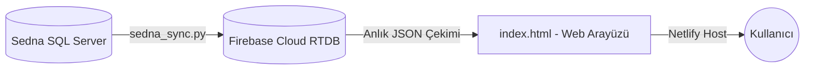

# Sedna Cloud İzleme Paneli — Proje & Senkronizasyon Dokümantasyonu

Bu doküman, Sedna SQL Server veritabanından alınan verilerin gerçek zamanlı olarak Firebase Realtime Database üzerinden web paneline aktarılması, görselleştirilmesi ve yapılan kritik düzeltmelerin detaylarını içerir.

---

## 1. Sistem Mimarisi & Veri Akışı

Sistem üç ana katmandan oluşur:
1. **SQL Server & Python Veri Çekici (`sedna_sync.py`):** Oteldeki yerel SQL Server veritabanına (`192.168.0.41`) bağlanır, günlük durum verilerini çeker, JSON snapshot'ı üretir ve Firebase REST API üzerinden buluta yükler.
2. **Bulut Veri Deposu (Firebase RTDB):** Canlı günlük verileri REST API üzerinden `adakoy-default-rtdb` veritabanında saklar.
3. **Frontend Web Dashboard (`index.html`):** Firebase'den verileri anlık olarak çeker, KPI özet kartlarını, filtreleri, acente dağılımlarını ve interaktif oda planı gridini gösterir. Netlify (`cooksclubadakoy.netlify.app`) üzerinde barındırılır.



---

## 2. Senkronizasyon Betiği (`sedna_sync.py`)

Python betiği, yerel SQL sunucusuna bağlanarak **Rezervasyon (Reservation)** ve **Oda Durum (Room)** tablolarından günlük verileri çeker.

### SQL Sorguları

#### A. Rezervasyon Verileri (Gelecek, Gidecek, Konaklayan):
```sql
SELECT 
    r.Voucher, r.GroupNo, r.RecId,
    r.FirstName1, r.LastName1,
    r.CheckinDate, r.CheckOutDate,
    r.Room, r.RoomType, r.Board,
    r.Pax, r.Childs, r.AgencyId, r.ExtraFolioBalance,
    r.ResRemark, r.FlightArrival, r.FlightDeparture,
    r.Status,
    a.AgencyCode
FROM Reservation r
LEFT JOIN Room rm ON r.RoomNummer = rm.RecId
LEFT JOIN Agency a ON r.AgencyId = a.RecId
WHERE r.StatusCode IN (0, 1, 2, 3)
  AND (r.RoomNummer = 0 OR r.RoomNummer IS NULL OR rm.ForeCast = 1)
  AND r.CheckinDate <= ? 
  AND r.CheckOutDate >= ?
```

#### B. Housekeeping & Oda Planı Verileri:
```sql
SELECT Room, RoomTypeCode, DirtyClean, HkStatus, OccVac 
FROM Room 
WHERE ForeCast = 1
```

---

## 3. Kritik Düzeltmeler & Güncelleme Geçmişi

### 🗓️ 09.08.2026 — Oda Durum (Temiz/Kirli) Senkronizasyon & Değerlendirme Mantığı Düzeltmesi

#### 🚨 Tespit Edilen Problem:
* **Sedna Cloud** (`cooksclubadakoy.netlify.app`) oda durum matrisindeki renkler ve temiz/kirli bilgisi, yerel **Sedna SQL Server** ve **HK Mobil (CC HK)** ekranlarındaki oda durumlarının **tam tersini** gösteriyordu (Örn: 101 nolu oda HK Mobil'de KİRLİ/Kırmızı iken Cloud'da TEMİZ/Yeşil görünüyordu).

#### 🔍 Kök Neden:
* `index.html` içerisindeki JavaScript rendering kodunda:
  ```javascript
  // ESKİ HATA:
  const isClean = hk.DirtyClean == 1;
  ```
  mantığı yazılmıştı. Ancak Sedna SQL Server veritabanı standartlarında `DirtyClean` sütunu:
  - **`DirtyClean = 0` ➔ TEMİZ**
  - **`DirtyClean = 1` ➔ KİRLİ**
  şeklindedir. Eski kod 1 değerini "Temiz" kabul ettiği için tüm odalar ters görünmekteydi.

#### 🛠️ Yapılan Düzeltmeler:
1. **`index.html` Mantığı Güncellendi:**
   ```javascript
   // YENİ DÜZELTİLMİŞ MANTIĞI:
   let dotColor = 'bg-rose-500 shadow-[0_0_6px_rgba(244,63,94,0.6)]';
   let statusText = 'Kirli';

   if (hk.HkStatus == 4) {
       dotColor = 'bg-amber-500 shadow-[0_0_6px_rgba(245,158,11,0.6)]';
       statusText = 'Arızalı (OOO)';
   } else if (hk.HkStatus == 5) {
       dotColor = 'bg-purple-500 shadow-[0_0_6px_rgba(168,85,247,0.6)]';
       statusText = 'Blokeli';
   } else if (hk.DirtyClean == 0 || hk.HkStatus == 2 || hk.HkStatus == 3) {
       dotColor = 'bg-emerald-500 shadow-[0_0_6px_rgba(16,185,129,0.6)]';
       statusText = 'Temiz';
   }
   ```
3. **Netlify Dağıtımı & Git Push:**
   - Düzeltmeler `society_makina/sedna_cloud_backup/dashboard/index.html` ve ana dizine işlendi.
   - `git push origin master` ile GitHub deponuza (`Gokhankin/sedna-cloud-backup`) gönderildi.
   - Güncel `index.html` dosyası Netlify Dashboard (`cooksclubadakoy.netlify.app`) paneline yüklenerek canlıya alındı.
4. **Giriş / Çıkış Tarihi Metin Hizalaması Düzeltildi:**
   - Tablodaki Giriş / Çıkış tarih hücrelerine (`<td>`) `whitespace-nowrap` ve `font-mono` sınıfları eklendi. Tarihlerin (örn: `2026-08-02`) dar ekranlarda kırılıp alt satıra kayması engellendi.

---

## 4. Canlıya Yayınlama & Netlify Dağıtım Prosedürü

Netlify üzerindeki canlı siteye güncelleme atarken dikkat edilmesi gerekenler:

1. **GitHub Senkronizasyonu:**
   Projede bir değişiklik yapıldığında commit ve push atın:
   ```bash
   git add .
   git commit -m "Güncelleme açıklaması"
   git push origin master
   ```
2. **Netlify Manuel Yükleme (Drag & Drop):**
   * Netlify projesi eğer doğrudan GitHub build pipeline'ına bağlı değilse; **[app.netlify.com](https://app.netlify.com)** adresine girin.
   * **`cooksclubadakoy`** ➔ **Deploys** alanına gelin.
   * Güncel `index.html` dosyasını / `dashboard` klasörünü "Drag and drop your site output folder here" kutusuna bırakın. Siteniz 3 saniyede güncellenecektir.

---

## 5. Firebase Güvenlik Kuralları & Uyarı Notu

* **Firebase RTDB:** Firebase panelinden gelen *"İstemci erişimi 0 gün içinde sona erecek"* e-postaları varsayılan 30 günlük deneme kuralı uyarısıdır.
* **Aktif Kurallar:** Veritabanı güvenlik kuralları okuma/yazma için açık (`".read": true, ".write": true`) duruma getirilmiştir.

---

### ⏱️ 17.08.2026 — Senkronizasyon Periyodu 5 Dakikaya Hizalandı

* **Problem/İhtiyaç:** Python veritabanı senkronizasyon betiği 15 dakikada bir çalışırken, frontend tarayıcı 2 dakikada bir yenileme yapıyordu. Bu durum tutarsızlık yaratmasa da gereksiz ağ trafiği oluşturuyor ve verilerin canlık süresini sınırlıyordu.
* **Yapılan Düzeltme:**
  1. Sunucu tarafındaki `sedna_sync.py` cron job sıklığı 15 dakikadan **5 dakikaya** düşürüldü (`*/5 * * * *`).
  2. Frontend `index.html` tarafındaki otomatik sorgulama zamanlayıcısı `300.000 ms` (**5 dakika**) olarak güncellendi.
  3. Değişiklikler Society makinesine (`192.168.0.128`) canlıya alındı.

---
*Doküman Son Güncelleme Tarihi: 17.08.2026*
